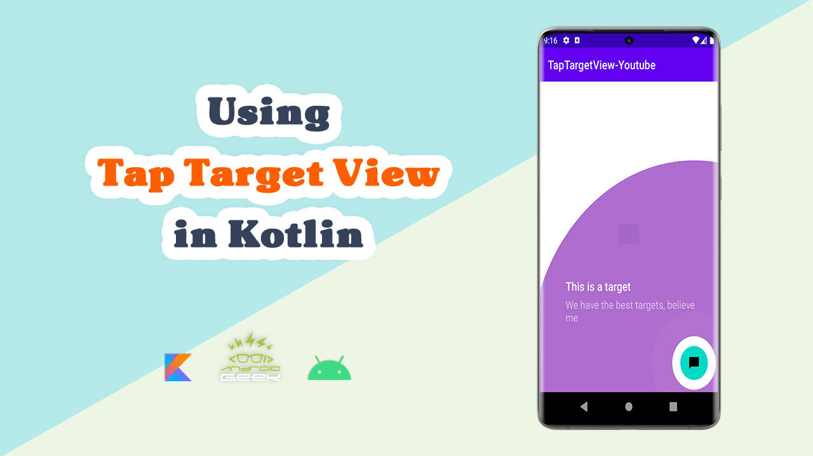

# TapTargetView-Youtube
</a>

YouTube Video :
   

 

Medium's Article :
 
https://towardsdev.com/create-tap-target-view-for-our-app-in-kotlin-fe5242757394

✨ Join Medium to read thousands of valuable stories ✨
 
https://medium.com/@ezatpanah/membership
